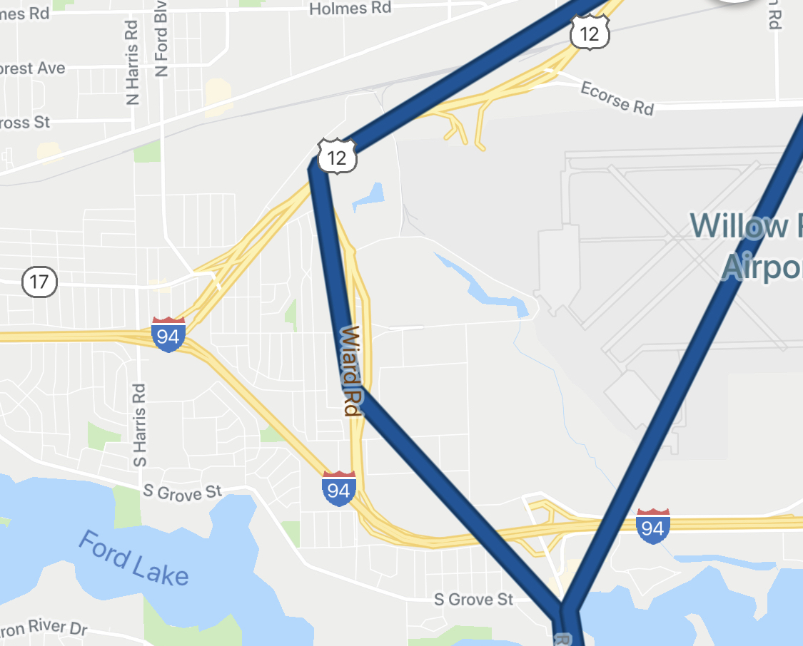

# Overland-Lambda

Your own personal NSA surveillance state in a single JS file 🔍

## Technical Motivation

This project was an excuse to learn how to use AWS lambda functions.
AWS Lambda functions are tangentially related to [one of my patents](http://patft.uspto.gov/netacgi/nph-Parser?Sect1=PTO2&Sect2=HITOFF&p=1&u=%2Fnetahtml%2FPTO%2Fsearch-bool.html&r=1&f=G&l=50&co1=AND&d=PTXT&s1=9934019&OS=9934019&RS=9934019), so it seemed appropriate that I try using them for something real.

## Personal Motivation

I had the unique opportunity to live in Japan for three months after quitting my job at Snap, Inc.
During that time, it occurred to me that it would be fun to visually retrace my steps through Japan over a map, and perhaps include some photo memories at appropriate destinations.
As a PoC, I wrote a short python script that converts [Google location history](https://takeout.google.com/settings/takeout) into GeoJSON for consumption by industry-standard tools.
I then loaded that data into Adobe After Effects to create this short video:

## Problem

Google location history accuracy is:

- not controllable in any sense except "don't ever kill Google Maps on your iPhone"
- applies clustering of some sort to corral your GPS points into Google Maps landmarks (if you're close to a Starbucks, it'll just move all your points over that Starbucks and group them as one)
- includes very little metadata
- in a non-standard proprietary geospatial format
- not available in real-time

My primary concerns are the first and second bullet.
Google Maps seems to have no discernible rhyme or reason to when it records your locations or not, and when it does, it doesn't give true device GPS coordinates.

### OK, who cares? That doesn't sound like a problem to me.

Trust me, the Google Location takeout data is awful for anything other than casually perusing as an end user.
The early visualizations I discarded where I teleport across roads while driving looked ridiculous.
In this example, I somehow managed to drive clear across a local jet-servicing airport.

Smashing down fences and driving across active runways in my crappy Ford Focus is a regular hobby of mine and was one of my best-kept secrets before opening up this repo.
I only ask that you please do not widely publicize this fact - I'm trying to secretly save these skills for the raid on Area 51 to see some sick UFOs 🛸

## Solution

AaronPK wrote a very cool iOS app called [Overland](https://overland.p3k.app/) that records GPS points using the iOS CoreLocation framework and reports them in batches using a very simple HTTPS json format.
It allows the high degree of customizability that I was looking for and the protocol was simple enough that writing a server for it is a no-brainer.

I managed to acquire the AWS Lambda, S3 basics, and IAM role knowledge necessary to complete the project end-to-end in a couple of hours.

## Technical Results

An AWS t2.nano instance would cost about \$5/month, require me to keep it secure/updated, and manually handle any outages.
This lambda solution costs less than a penny per month, s3 costs included, and requires no maintenance on my part.

## I want to see cool stuff tho

Using this data to make cool visualizations is a problem left unsolved as of yet.
However, I did get the chance to merge some of the GeoJson data from recent times and load it into Uber's [Kepler.gl](https://kepler.gl/) framework to make a PoC visualization and validate the data.

What you see here is all the points recorded over a short window continually scrubbing over time. The color of the points represents my phone's battery level at the time of recording.

## Next steps

- Go on another adventure overseas to try this out for real :)
- Create some cool transitions in After Effects for the actual "creative" part of this project. Thankfully, [countless solutions for this already exist!](https://videohive.net/item/handy-seamless-transitions-pack-script/18967340)
